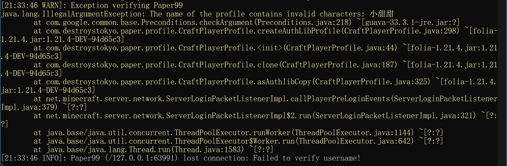

# FixUsernameCheck

这是一个Minecraft服务器补丁，可以禁用玩家游戏名检查，从而可以在服务器中使用中文名

## 使用方法

1. 下载补丁的jar文件

2. 启动服务器时添加`-javaagent:FixUsernameCheck.jar`参数。
   如：`java -javaagent:FixUsernameCheck.jar -jar server.jar --nogui`
   `FixUsernameCheck.jar`为你的补丁文件，这里与MC服务器核心放置在同一目录下

## 说明

- 如果补丁jar文件放置在其它目录下，请使用相对路径或绝对路径，如：
  `java -javaagent:./fix/FixUsernameCheck.jar -jar server.jar --nogui`

## 为什么需要该补丁？

貌似从 MC1.21 版本更新后，多了一项用户名检查，即使你在 Paper 或 Luminol 的配置文件中禁用了
username check，但还是不生效。

此项用户名检查不是在认证阶段发生的，而是在 pre-login 阶段发生的。

通过此补丁可禁用该阶段的用户名检查，从而使那些使用了中文名或奇怪名字的玩家可以进入服务器。

